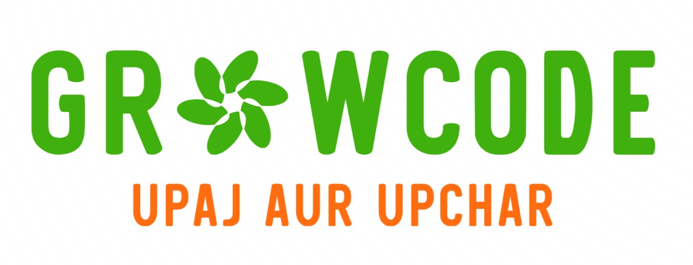

# GrowCode - One-Stop Solution for Agriculture Landscape



## Overview

**GrowCode** is a comprehensive smart farming platform transforming traditional agriculture into data-driven precision farming. The application leverages IoT sensors, AI, and cloud computing to provide farmers with actionable insights for precise fertilization and holistic farming care. By focusing on "moving from excess to precision," GrowCode helps farmers optimize fertilizer use, increase crop yields, improve soil health, and enhance profitability while promoting sustainable agricultural practices. 

## Problem 

Despite the Green Revolution's success in feeding billions, excessive fertilizer use has led to soil degradation and environmental damage. Farmers face a critical dilemma: using too little fertilizer reduces yields, while using too much wastes money and harms the environment. Current farming applications typically focus on general advice or record-keeping, failing to address precision fertilization with accessible technology effectively. This gap costs farmers up to 40% in wasted expenses while continuing to damage our environment.

## Key Features

### 1. Smart Soil Monitoring
Real-time tracking of soil health parameters (NPK, pH, moisture, temperature) through affordable IoT sensors, generating comprehensive Soil Health Report Cards with color-coded status indicators.

### 2. Precision Fertilizer Recommendation
Tailored guides recommending the best-suited fertilizers (organic/inorganic/hybrid), optimal quantities, and application schedules based on soil health and crop stage needs, powered by AI analysis.

### 3. Crop Disease Detection
AI-powered analysis of plant images to identify diseases with high accuracy, providing specific treatment recommendations and preventive measures to minimize crop losses.

### 4. Crop Prediction System
Recommendations of suitable crop combinations for crop rotation based on real-time soil parameters, with comprehensive guides on planting, care, and harvesting techniques.

### 5. Fertilizer Pedia
Knowledge portal educating farmers on nutrient management and agronomical practices, with detailed guides on crop-wise fertilizer needs and stage-wise nutrient requirements.

### 6. Multilingual Interface
Accessible in multiple regional languages to overcome literacy barriers and ensure wider adoption across diverse farming communities.

### 7. Weather Alerts & Forecasting
15-day forecasts, seasonal predictions, and extreme weather alerts with farming recommendations based on weather conditions.

### 8. Government Scheme Navigator
Regularly updated information on subsidies, grants, and farming programs with eligibility criteria and application guidance.

### 9. Market Intelligence
Real-time crop market prices (Mandi rates) to help farmers make informed decisions about harvest timing and crop selection.

## Important Links

- [APK](https://drive.google.com/drive/folders/10PXVfk7SEJDg5w0RjuILpRPFm8IJsi2i?usp=drive_link)

## Technology Stack

### Frontend
- **Flutter**: Cross-platform framework for building mobile application interfaces
- **Dart**: Programming language used with Flutter
- **Material Design**: UI component library for consistent design patterns

### Backend
- **Firebase**: Real-time database for storing and syncing data
- **Google Cloud Platform**: Cloud infrastructure for hosting and scaling the application
- **Vertex AI**: For deploying and managing machine learning models

### AI/ML
- **Gemini API**: Powers intelligent recommendations and personalized insights
- **TensorFlow**: For training custom machine learning models
- **Google Teachable Machine**: Used for training the crop disease detection model

### IoT Components
- **Custom Soil Sensors**: For collecting NPK, moisture, pH, and temperature data
- **Arduino and ESP32**: Microcontroller for the sensor setup
- **MQTT**: Protocol for IoT device communication

### APIs
- **Weather API**: For real-time weather data and forecasting
- **Government Data APIs**: For information on agricultural schemes and subsidies
- **Market Price APIs**: For real-time crop price data

##  Requirements

* Any Operating System (ie. MacOS X, Linux, Windows)  
* Any IDE with Flutter SDK installed (ie. IntelliJ, Android Studio, VSCode etc)  
* A little knowledge of Dart and Flutter  

##  Steps to Run the Application 

- Clone the GitHub Repository:

  ```bash
  git clone https://github.com/BadassAman4014/GrowwCode.git
  ```

- Navigate to the Project Directory:

  ```bash
  cd Farmily-revised
  ```

- Get Dependencies:

  ```bash
  flutter pub get
  ```

- Get the suitable version of tflite to run the app:

  Replace these lines in the tflite package `build.gradle` file  
  Example location:  
  `C:\Users\"username"\AppData\Local\Pub\Cache\hosted\pub.dev\tflite-1.1.2\android\build.gradle`

  ```groovy
  implementation 'org.tensorflow:tensorflow-lite:2.0.0'
  implementation 'org.tensorflow:tensorflow-lite-gpu:2.0.0'
  ```

  After replacing, it should look like:

  ```groovy
  android {
    compileSdkVersion 28

    defaultConfig {
        minSdkVersion 19
        testInstrumentationRunner 'androidx.test.runner.AndroidJUnitRunner'
    }
    lintOptions {
        disable 'InvalidPackage'
    }

    dependencies {
        implementation 'org.tensorflow:tensorflow-lite:2.0.0'
        implementation 'org.tensorflow:tensorflow-lite-gpu:2.0.0'
    }
  }
  ```

- Run install.bat

  ```bash
  install.bat
  ```

- Run the Flutter application

  ```bash
  flutter run
  ```

## Our Members 

- Valhari Meshram  
- Aman Raut  
- Viranchi Dakhare

### Contributors

Join us in cultivating innovation in Indian agriculture. Your contributions are the seeds of change! 🌱🤝
